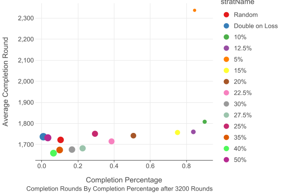
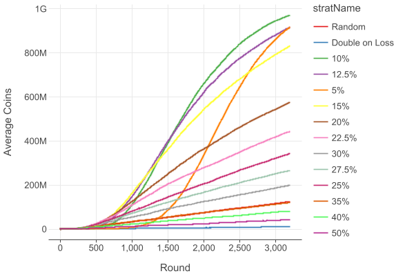

I tested different pogo !dice gamble strats to see which is the best to get to 1bil with. If you want me to try out any other strats just ping me^^!
# Simulation Setup
I tried 14 different strats. Each strat was played 10k times for 3200 rounds or until the game reached 1bil.
If you assume perfect play (work and dice each hour 24/7) this simulation simulated about 448.000.000h or ~52k years of gambling :money_mouth:
# Strats
Most strats (all with the XX%) are betting XX% of your !coins
I also tested "random" bets and the strat where you double your wager each time you lose.
# Axis Description
## X-axis: Completion Percentage
`Completion Percentage` is how likely it is that you will have reached 1bil when using the strat.
## Y-axis: Average Completion Round
The `Average Completion Round` is the average round 1bil is reached for each strategy. **NOTE**: This number is calculated by only looking at the games where the strat actually reached 1bil. So it does not mean that strats are inherently better just because the avg completion round is low.
## Point Size
The size of the dots is relative to variance of the completion round. Meaning: the bigger the point the more uncertain it is to hit around the "average completion round". It could be a lower or higher.
# Conclusion
The most consistent way to get to 1bil (from the strats tested here) is probably betting between 10% to 12.5% of your current coin stash.
If you want to go riskier look further left. It is less likely that you will  actually finish within 3.2k rounds but if you do there is higher variance, which means there is a small chance of you finishing way earlier.
IMO 10 to 12.5 percent is the best strat :thumbsup: Thanks for coming to my TED Talk

